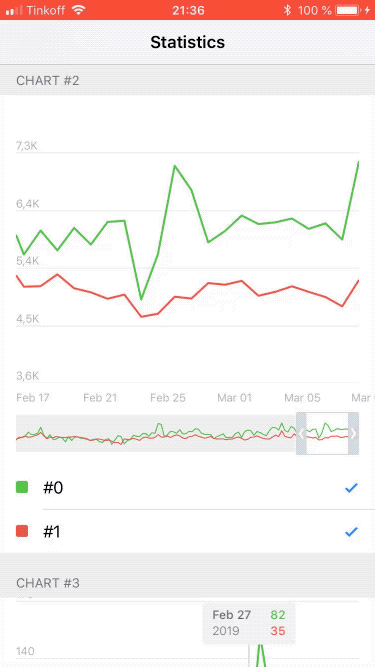

# TelegramLineChart

An app for 2019 Telegram iOS Development contest (https://t.me/contest/6).

The goal of the app is to display a set of animated line charts based on the data from a provided JSON file. 

No 3rd party libraries used, all drawing is done via Quartz2D and Core Animation frameworks.

Optimized for performance to achieve smooth animations even on slower devices.

## Demo

## Requirements

* iOS 11.0+

* Xcode 10.1+

* Swift 4.2

## License

TelegramLineChart is released under GNU GPLv3 License. See [LICENSE.txt](LICENSE.txt) to see the full text.